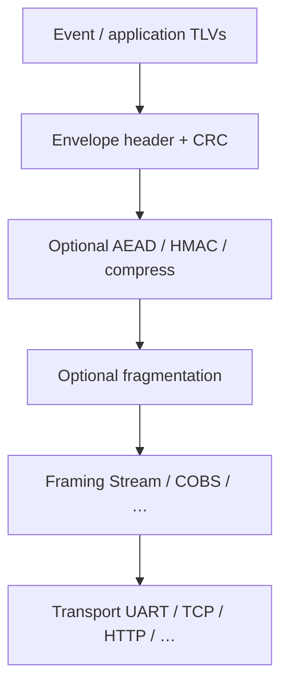

# Architecture

## Layers

Validate in order: framing → envelope integrity → security → TLV parse → application.

The envelope does not embed transport headers. Same LEP bytes may go UART, file, or HTTP.
