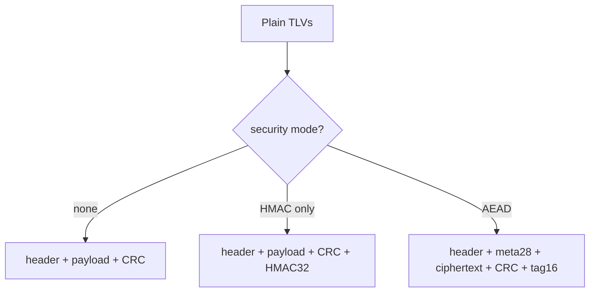
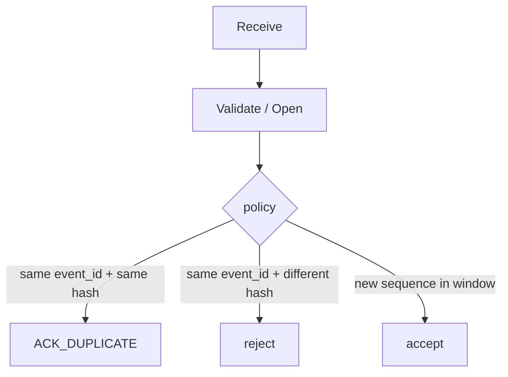

# Encryption and Authentication (v1.0)

**Status:** Frozen — device path (Latch) is normative for all producers.

## Flags

| Flag | Bit | Role |
|------|----:|------|
| AUTHENTICATED | 0 | Auth trailer present |
| ENCRYPTED | 1 | Payload ciphertext |
| AEAD | 2 | Metadata block present |

Rules: ENCRYPTED ↔ AEAD; AEAD requires AUTHENTICATED. TRUNCATED (3) and COMPRESSED (4) may combine with security flags.



## AEAD — XChaCha20-Poly1305 (device path)

### Metadata (28 bytes)

| Offset | Size | Field |
|-------:|-----:|-------|
| 0 | 24 | Nonce (XChaCha20) |
| 24 | 4 | key_id u32 LE |

### Wire

| Region | Size |
|--------|-----:|
| Fixed header | 24 |
| Metadata | 28 |
| Ciphertext | payload_length |
| Payload CRC | 4 = CRC32(metadata \|\| ciphertext) |
| Poly1305 tag | 16 |

### Parameters

| Item | Value |
|------|-------|
| Algorithm | XChaCha20-Poly1305 |
| AAD | header(24) \|\| metadata(28) |
| IKM | 32-byte device key |
| KDF | HKDF-SHA256 |
| salt | key_id \|\| sequence \|\| event_id (12 bytes LE) |
| info | `laststate/latch/envelope/v1` (ASCII, no NUL) |
| Output | 32-byte derived key |

MUST NOT reuse (derived_key, nonce). Implementations MUST verify tag before exposing plaintext.

Golden: [`../test-vectors/crypto/aead-xchacha.hex`](../test-vectors/crypto/aead-xchacha.hex).

## Auth-only — HMAC-SHA-256

| Region | Size |
|--------|-----:|
| Header | 24 |
| Payload | N |
| Payload CRC | 4 |
| HMAC | 32 |

```
mac = HMAC-SHA-256(key, header || payload || payload_crc)
```

Key id is out of band (config). Prefer the same numeric id space as AEAD `key_id`.

Golden: [`../test-vectors/crypto/hmac-auth-only.hex`](../test-vectors/crypto/hmac-auth-only.hex).

## Replay



Default sequence window size: **64**.

## Non-goals (v1.0)

- Asymmetric envelope signatures (see signatures.md for bundles)  
- Gateway-only historical metadata packing (removed; use device path)  
