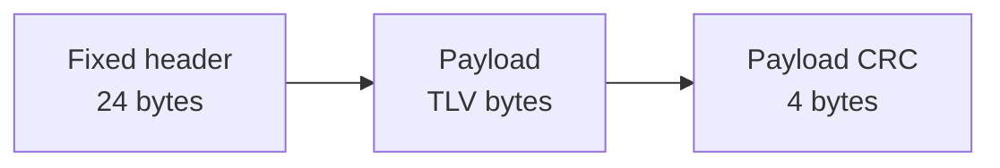

# LEP v1 — wire format

**Version:** header `version = 1`  
**Endianness:** little-endian multi-byte integers  
**Magic:** fixed bytes `4C 53 54 50` (`LSTP`), not a host `uint32` store

Matches Latch encode and Relay validate for the plain path. Crypto: [`encryption.md`](encryption.md).

---

## 1. Overview

A complete plain envelope is:



With security flags set, metadata and/or authentication trailers are inserted as defined in §6.

Total length of a plain envelope:

```
total = 24 + payload_length + 4
```

Receivers MUST reject integer overflow, truncated buffers, and any `payload_length` that does not exactly match the remaining bytes after header and trailers.

---

## 2. Fixed header (24 bytes)

| Offset | Size | Type | Field | Description |
|-------:|-----:|------|-------|-------------|
| 0 | 4 | bytes | `magic` | Canonical bytes `4C 53 54 50` (`LSTP`) |
| 4 | 1 | u8 | `version` | Protocol version; **1** for this document |
| 5 | 1 | u8 | `event_type` | See [`../registry/tlv-types.md`](../registry/tlv-types.md) |
| 6 | 1 | u8 | `architecture` | See [`architectures.md`](architectures.md) |
| 7 | 1 | u8 | `flags` | Bitmap §5 |
| 8 | 4 | u32 | `sequence` | Producer sequence counter |
| 12 | 4 | u32 | `event_id` | Stable event identifier |
| 16 | 4 | u32 | `payload_length` | Bytes of payload (not including CRCs/trailers) |
| 20 | 4 | u32 | `header_crc` | CRC-32 of bytes `[0..20)` |

### 2.1 Magic

| Representation | Value |
|----------------|-------|
| ASCII | `LSTP` |
| Canonical bytes | `4C 53 54 50` |
| LE `uint32` read of those bytes | `0x5054534C` |

Implementations MUST compare the four bytes, not a host-endian integer constant alone.

### 2.2 Endianness

- `u16`, `u32`, `u64`: little-endian
- Multi-byte fields inside TLV values: little-endian unless the field document says otherwise
- Floats (if ever used): IEEE-754 little-endian
- Bitfields of C structs MUST NOT be used as the on-wire format

### 2.3 Version

| Value | Meaning |
|------:|---------|
| 1 | LEP v1 Core (this document) |
| 2 | LEP v2 Core ([`lep-v2.md`](lep-v2.md)) — identical wire, version-bound KDF label |
| other | Unsupported — receiver MUST reject |

Future compatible additions use the same major version only when the fixed header layout and semantics of existing fields remain unchanged. See [`compatibility.md`](compatibility.md).

---

## 3. Integrity

### 3.1 Algorithm

CRC-32 matching **CRC-32/ISO-HDLC** (also known as CRC-32/IEEE):

| Parameter | Value |
|-----------|-------|
| Polynomial (normal) | `0x04C11DB7` |
| Polynomial (reflected) | `0xEDB88320` |
| Init | `0xFFFFFFFF` |
| RefIn / RefOut | true |
| XorOut | `0xFFFFFFFF` |

This matches common `zlib.crc32` / Go `hash/crc32.ChecksumIEEE` / many MCU libraries.

### 3.2 Header CRC

```text
header_crc = CRC32(header[0 .. 20))
```

Stored little-endian at offset 20.

### 3.3 Payload CRC

For plain envelopes (no AEAD metadata):

```text
payload_crc = CRC32(payload_bytes)
```

Stored as 4 little-endian bytes immediately after the payload.

With AEAD, the payload CRC covers `metadata || ciphertext` — see [`encryption.md`](encryption.md).

CRC alone MUST NOT be treated as cryptographic authentication.

Full rules: [`integrity.md`](integrity.md).

---

## 4. Payload (TLV sequence)

An unencrypted, uncompressed payload is a concatenation of TLVs with **no padding**:

```text
TLV = type (u16 LE) || length (u16 LE) || value (length bytes)
```

| Rule | Requirement |
|------|-------------|
| `type == 0` | MUST be rejected (reserved) |
| Incomplete 4-byte header | MUST be rejected |
| `length` exceeds remaining payload | MUST be rejected |
| Unknown type | MUST be **skipped** by length (non-critical default) |
| Contiguous | No alignment padding between TLVs |

Assigned types: [`registry/tlv-types.md`](../registry/tlv-types.md) and [`identity.md`](identity.md).

---

## 5. Flags (header byte offset 7)

| Bit | Mask | Name | Meaning |
|----:|-----:|------|---------|
| 0 | `0x01` | `AUTHENTICATED` | Authentication trailer present |
| 1 | `0x02` | `ENCRYPTED` | Payload is ciphertext |
| 2 | `0x04` | `AEAD` | 28-byte AEAD metadata present |
| 3 | `0x08` | `TRUNCATED` | Sender omitted optional fields due to capacity |
| 4 | `0x10` | `COMPRESSED` | Payload is compressed; see §5.2 |
| 5–7 | | reserved | MUST be zero on send; unknown set bits MUST be rejected |

### 5.1 Flag combination rules

1. `ENCRYPTED` and `AEAD` MUST both be set or both clear.
2. If `AEAD` is set, `AUTHENTICATED` MUST also be set.
3. `TRUNCATED` MAY combine with any valid security combination.
4. `COMPRESSED` MAY combine with any valid security combination. A receiver
   that does not implement the selected compression codec MUST reject the
   envelope before interpreting its payload.
5. Receivers MUST reject unknown flag bits (v1: any bit outside `0x1F`).

### 5.2 Compressed payloads

`COMPRESSED` is bit 4; `TRUNCATED` remains bit 3. The compressed payload is
opaque until decompressed successfully, so receivers MUST NOT parse TLVs or
make routing decisions from it first. Compression selection and bounds are
defined in [`compression.md`](compression.md).

---

## 6. Security layouts (summary)

### 6.1 Plain

```
header(24) || payload || payload_crc(4)
```

### 6.2 Authenticated only (HMAC-SHA-256)

```
header(24) || payload || payload_crc(4) || hmac(32)
```

Device path (Latch): HMAC over `header || payload || payload_crc` (all bytes before the HMAC).

See [`encryption.md`](encryption.md) for AAD details and gateway divergences.

### 6.3 AEAD (XChaCha20-Poly1305 device path)

Metadata (28 bytes) after header:

| Offset | Size | Field |
|-------:|-----:|-------|
| 0 | 24 | XChaCha20 nonce |
| 24 | 4 | `key_id` (u32 LE) |


- `payload_length` equals ciphertext length.
- `payload_crc` covers `metadata || ciphertext`.
- AAD for AEAD is `header || metadata` (Latch device path).
- Implementations MUST authenticate before exposing plaintext TLVs.

---

## 7. Sequence and event_id

| Field | Size | Rules |
|-------|-----:|-------|
| `sequence` | 32-bit | Unsigned; producer increments per emitted event. Overflow wraps mod 2³². Receivers MAY use a sliding window for replay protection. |
| `event_id` | 32-bit | Stable for retransmissions of the same logical event. Producers SHOULD avoid collisions (Latch derives from payload CRC ⊕ sequence ⊕ build hash). |

*Future major versions MAY widen `event_id` to 128 bits; v1 MUST remain 32-bit for interoperability.*

Recommended consumer replay window size: **64** sequences (as implemented by Latch helpers).

---

## 8. Validation algorithm (normative)

A receiver MUST perform these steps in order:

1. If `length < 28`, reject (`too short` for plain minimum).
2. If `data[0..4) != 4C 53 54 50`, reject (`bad magic`).
3. If `version != 1`, reject (`unsupported version`).
4. Parse `flags`; if invalid combination or unknown bits, reject.
5. Compute `metadata_len` / `auth_len` from flags.
6. Read `payload_length`; check `length == 24 + metadata_len + payload_length + 4 + auth_len` with overflow-safe arithmetic.
7. If `length` exceeds configured maximum, reject (`too large`) **before** allocating.
8. Verify `header_crc`.
9. Verify `payload_crc` over the covered region.
10. If encrypted, authenticate then decrypt into a bounded buffer; else validate TLV structure.
11. Optionally apply replay policy on `(device, sequence)` or `(device, event_id)`.

---

## 9. Limits (defaults)

| Limit | Default | Notes |
|-------|--------:|-------|
| Fixed header | 24 | Constant |
| Max envelope | 4 MiB | Gateway default; MCU may be much smaller |
| Recommended MCU envelope | ≤ 64 KiB | Product policy |
| AEAD metadata | 28 | When AEAD set |
| HMAC size | 32 | Auth-only |
| AEAD tag | 16 | Poly1305 |
| Max TLV value | 65535 | `u16` length |
| Replay window | 64 | Informative default |

Full table: [`limits.md`](limits.md).

---

## 10. Golden vector (plain)

File: [`../test-vectors/valid/lep-v1-basic.hex`](../test-vectors/valid/lep-v1-basic.hex)

```text
4c5354500102000007000000090000000600000074ddc48901000200aabbea84ccd8
```

| Field | Value |
|-------|-------|
| magic | `LSTP` |
| version | 1 |
| event_type | 2 (`ERROR`) |
| architecture | 0 (`UNKNOWN`) |
| flags | 0 |
| sequence | 7 |
| event_id | 9 |
| payload_length | 6 |
| TLV | type=1, length=2, value=`aa bb` |

Reference codec: [`../implementations/go`](../implementations/go).

---

## 11. Non-goals

- 128-bit event IDs (v1 is 32-bit)
- CBOR payloads
- Transport headers inside the envelope
