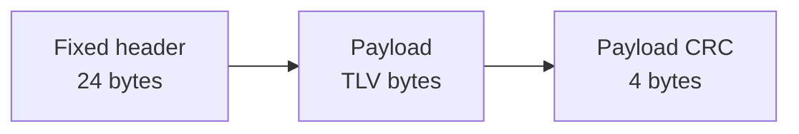

# LEP v2 — wire format

**Version:** header `version = 2`  
**Endianness:** little-endian multi-byte integers  
**Magic:** fixed bytes `4C 53 54 50` (`LSTP`), not a host `uint32` store

LEP v2 keeps the exact v1 fixed header layout, flags, CRC, and security
layouts. It changes only the wire version byte and the crypto domain
separation. v1 and v2 are interoperable on the wire; v2 is the default for
new producers. See [`compatibility.md`](compatibility.md) for the v1→v2
boundary.

Crypto: [`encryption.md`](encryption.md). Framing: [`framing.md`](framing.md).

---

## 1. Overview

A complete plain envelope is:



Total length of a plain envelope:

```
total = 24 + payload_length + 4
```

Receivers MUST reject integer overflow, truncated buffers, and any
`payload_length` that does not exactly match the remaining bytes after header
and trailers.

---

## 2. Fixed header (24 bytes)

| Offset | Size | Type | Field | Description |
|-------:|-----:|------|-------|-------------|
| 0 | 4 | bytes | `magic` | Canonical bytes `4C 53 54 50` (`LSTP`) |
| 4 | 1 | u8 | `version` | Protocol version; **2** for this document |
| 5 | 1 | u8 | `event_type` | See [`../registry/tlv-types.md`](../registry/tlv-types.md) |
| 6 | 1 | u8 | `architecture` | See [`architectures.md`](architectures.md) |
| 7 | 1 | u8 | `flags` | Bitmap §5 |
| 8 | 4 | u32 | `sequence` | Producer sequence counter |
| 12 | 4 | u32 | `event_id` | Stable event identifier |
| 16 | 4 | u32 | `payload_length` | Bytes of payload (not including CRCs/trailers) |
| 20 | 4 | u32 | `header_crc` | CRC-32 of bytes `[0..20)` |

### 2.1 Magic

Identical to v1 (§2.1 of [`lep-v1.md`](lep-v1.md)): compare the four bytes,
never a host-endian integer constant alone.

### 2.2 Version

| Value | Meaning |
|------:|---------|
| 1 | LEP v1 Core ([`lep-v1.md`](lep-v1.md)) — MUST still be accepted |
| 2 | LEP v2 Core (this document) — default for new producers |
| other | Unsupported — receiver MUST reject |

Decoders that understand v2 MUST also accept v1 (backward compatibility).
v2 changes do not alter the meaning of any v1 field.

---

## 3. Integrity

Identical to v1 §3: CRC-32/ISO-HDLC over the same regions.

---

## 4. Payload (TLV sequence)

Identical to v1 §4: `type (u16 LE) || length (u16 LE) || value`, with the same
rejection rules for type 0, truncation, and oversized lengths.

---

## 5. Flags

Identical to v1 §5. The flag bitmap is unchanged between v1 and v2.

---

## 6. Security layouts

Identical to v1 §6 with one difference: the KDF info label is bound to the
wire version (§6.4). See [`encryption.md`](encryption.md) for the full
parameters.

### 6.1 Plain

```
header(24) || payload || payload_crc(4)
```

### 6.2 Authenticated only (HMAC-SHA-256)

```
header(24) || payload || payload_crc(4) || hmac(32)
```

### 6.3 AEAD (XChaCha20-Poly1305)

```
header(24) || metadata(28) || ciphertext || crc(4) || tag(16)
```

### 6.4 Version-bound key derivation

| Version | HKDF info label (ASCII, no NUL) |
|--------:|---------------------------------|
| 1 | `laststate/latch/envelope/v1` |
| 2 | `laststate/latch/envelope/v2` |

The label MUST be selected from the envelope's own `version` byte. Using the
version-dependent label prevents cross-version key reuse: a ciphertext sealed
under v1 can never verify under v2, even with the same IKM, salt, and nonce.

---

## 7. Sequence and event_id

Identical to v1 §7. Recommended replay window: **64**.

---

## 8. Validation algorithm (normative)

Same ordered steps as v1 §8, except step 3:

3. If `version` is neither `1` nor `2`, reject (`unsupported version`).

---

## 9. Limits (defaults)

| Limit | Default | Notes |
|-------|--------:|-------|
| Fixed header | 24 | Constant |
| Max envelope | 4 MiB | Gateway default; MCU may be much smaller |
| Recommended MCU envelope | ≤ 64 KiB | Product policy |
| AEAD metadata | 28 | When AEAD set |
| HMAC size | 32 | Auth-only |
| AEAD tag | 16 | Poly1305 |
| Max TLV value | 65535 | `u16` length |
| Replay window | 64 | Informative default |

Full table: [`limits.md`](limits.md).

---

## 10. Golden vectors

| File | Content |
|------|---------|
| [`../test-vectors/valid/lep-v2-basic.hex`](../test-vectors/valid/lep-v2-basic.hex) | Plain envelope, version 2 |
| [`../test-vectors/crypto/aead-xchacha-v2.hex`](../test-vectors/crypto/aead-xchacha-v2.hex) | AEAD with documented test key |
| [`../test-vectors/crypto/hmac-auth-only-v2.hex`](../test-vectors/crypto/hmac-auth-only-v2.hex) | HMAC-only with documented test key |
| [`../test-vectors/transports/latch-stream-basic-v2.hex`](../test-vectors/transports/latch-stream-basic-v2.hex) | Latch Stream framing, version 2 |

All v1 vectors remain valid and MUST keep decoding.

`valid/lep-v2-basic.hex`:

```text
4c5354500202000007000000090000000600000086690ca001000200aabbea84ccd8
```

| Field | Value |
|-------|-------|
| magic | `LSTP` |
| version | 2 |
| event_type | 2 (`ERROR`) |
| architecture | 0 (`UNKNOWN`) |
| flags | 0 |
| sequence | 7 |
| event_id | 9 |
| payload_length | 6 |
| TLV | type=1, length=2, value=`aa bb` |

Reference codec: [`../implementations/go`](../implementations/go).

---

## 11. Non-goals

Same as v1 §11. v2 does not widen `event_id`, change the magic, or alter
transport framing.